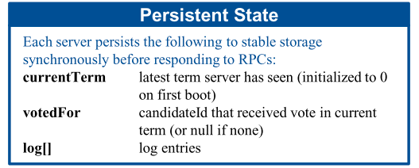
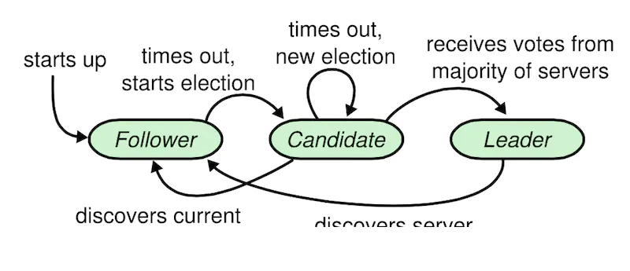
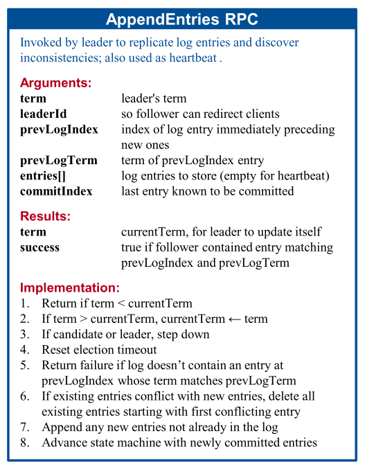
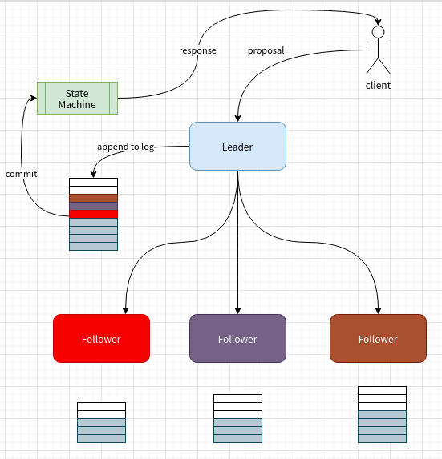
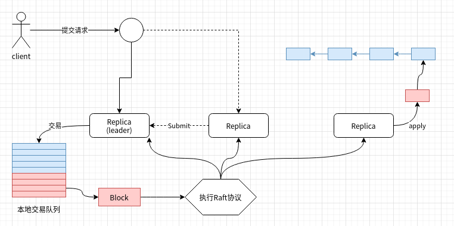

# Raft

## Raft协议

### 任期\(Term\)

一个单调递增的计数器，在每次发生领导选举时递增

### 节点状态

#### 持久状态



#### WAL日志


### 节点角色

Raft协议中副本节点可能处于的角色:

* Leader
* Follower
* Candidate



#### Follower功能


#### Candidate功能


#### Leader功能


### RPC

#### RequestVote


#### AppendEntries



### 领导选举

#### 触发时机:

发生选举超时\(Election timeout\)或者收到其他节点的RequestVote合法请求后，节点进入领导选举周期。

选举超时是一个节点从Follower变成一个Candidate所需要等待的时间。一般在100ms到500ms之间随机\(随机是为了尽量避免产生多个candidate，给选主过程制造麻烦\)。

Follow在收到Leader合法的Append Entries消息后会重置选举超时。

#### 选举流程

1. 增加Term计数
2. 变更为Candidate角色
3. 投票给自己
4. 向其他节点发送RequestVote请求
   * 接收到大多数节点的赞成票: 变更为Leader角色，然后周期性发送AppendEntries消息
   * 接受到其他Leader节点的有效消息: 变更为Follower角色
   * 选举超时，重新发起选举流程。

### 事务提交



1. 客户端向Leader提交一个是事务请求
2. Leader将请求保存到本地WAL日志，然后像Follower发送AppendEntries请求。
3. Leader收到大多数节点AppendEntries成功响应，执行事物请求完成状态迁移。
4. Leader将事务执行后的结果响应给客户端。

## 配置

### 配置文件

```yaml
Cluster:
        ReplicationBackgroundRefreshInterval: 5*time.Minute #默认5分钟
        ReplicationMaxRetries: 12 # 副本失败重试次数，默认12.
        ReplicationRetryTimeout: 5e6 #副本重试间隔时间, 默认5s，单位纳秒
        SendBufferSize: 10
        ClientCertificate:
        ClientPrivateKey:
        ListenPort:
        ListenAddress:
        ServerCertificate:
        ServerPrivateKey:
        RootCAs:
        - ""
```

### 创世块

```yaml
Organizations:

    # SampleOrg defines an MSP using the sampleconfig. It should never be used
    # in production but may be used as a template for other definitions.
    - &SampleOrg
        # OrdererEndpoints is a list of all orderers this org runs which clients
        # and peers may to connect to to push transactions and receive blocks respectively.
        OrdererEndpoints:
            - "127.0.0.1:7050"

#### orderer type configuration
SampleDevModeEtcdRaft:
        <<: *ChannelDefaults
        Orderer:
            <<: *OrdererDefaults
            OrdererType: etcdraft
            Organizations:
                - <<: *SampleOrg
#### etcd raft configuration   
Orderer: &OrdererDefaults
    # Addresses used to be the list of orderer addresses that clients and peers
    # could connect to.  However, this does not allow clients to associate orderer
    # addresses and orderer organizations which can be useful for things such
    # as TLS validation.  The preferred way to specify orderer addresses is now
    # to include the OrdererEndpoints item in your org definition
    Addresses:
        # - 127.0.0.1:7050
    # Orderer Type: The orderer implementation to start.
    # Available types are "solo", "kafka" and "etcdraft".
    OrdererType: etcdraft        
    EtcdRaft:
        # The set of Raft replicas for this network. For the etcd/raft-based
        # implementation, we expect every replica to also be an OSN. Therefore,
        # a subset of the host:port items enumerated in this list should be
        # replicated under the Orderer.Addresses key above.
        Consenters:
            - Host: raft0.example.com
              Port: 7050
              ClientTLSCert: path/to/ClientTLSCert0
              ServerTLSCert: path/to/ServerTLSCert0
            - Host: raft1.example.com
              Port: 7050
              ClientTLSCert: path/to/ClientTLSCert1
              ServerTLSCert: path/to/ServerTLSCert1
            - Host: raft2.example.com
              Port: 7050
              ClientTLSCert: path/to/ClientTLSCert2
              ServerTLSCert: path/to/ServerTLSCert2

        # Options to be specified for all the etcd/raft nodes. The values here
        # are the defaults for all new channels and can be modified on a
        # per-channel basis via configuration updates.
        Options:
            # TickInterval is the time interval between two Node.Tick invocations.
            TickInterval: 500ms

            # ElectionTick is the number of Node.Tick invocations that must pass
            # between elections. That is, if a follower does not receive any
            # message from the leader of current term before ElectionTick has
            # elapsed, it will become candidate and start an election.
            # ElectionTick must be greater than HeartbeatTick.
            ElectionTick: 10

            # HeartbeatTick is the number of Node.Tick invocations that must
            # pass between heartbeats. That is, a leader sends heartbeat
            # messages to maintain its leadership every HeartbeatTick ticks.
            HeartbeatTick: 1

            # MaxInflightBlocks limits the max number of in-flight append messages
            # during optimistic replication phase.
            MaxInflightBlocks: 5

            # SnapshotIntervalSize defines number of bytes per which a snapshot is taken
            SnapshotIntervalSize: 20 MB
```

## 网络架构


### 协议

#### 块拉取

```text
message SeekInfo {
   // If BLOCK_UNTIL_READY is specified, the reply will block until the requested blocks are available,
   // if FAIL_IF_NOT_READY is specified, the reply will return an error indicating that the block is not
   // found.  To request that all blocks be returned indefinitely as they are created, behavior should be
   // set to BLOCK_UNTIL_READY and the stop should be set to specified with a number of MAX_UINT64
    enum SeekBehavior {
        BLOCK_UNTIL_READY = 0;
        FAIL_IF_NOT_READY = 1;
    }

    // SeekErrorTolerance indicates to the server how block provider errors should be tolerated.  By default,
    // if the deliver service detects a problem in the underlying block source (typically, in the orderer,
    // a consenter error), it will begin to reject deliver requests.  This is to prevent a client from waiting
    // for blocks from an orderer which is stuck in an errored state.  This is almost always the desired behavior
    // and clients should stick with the default STRICT checking behavior.  However, in some scenarios, particularly
    // when attempting to recover from a crash or other corruption, it's desirable to force an orderer to respond
    // with blocks on a best effort basis, even if the backing consensus implementation is in an errored state.
    // In this case, set the SeekErrorResponse to BEST_EFFORT to ignore the consenter errors.
    enum SeekErrorResponse {
        STRICT = 0;
        BEST_EFFORT = 1;
    }
    SeekPosition start = 1;               // The position to start the deliver from
    SeekPosition stop = 2;                // The position to stop the deliver
    SeekBehavior behavior = 3;            // The behavior when a missing block is encountered
    SeekErrorResponse error_response = 4; // How to respond to errors reported to the deliver service
}
```

### Step消息

```text
message StepRequest {
    oneof payload {
        // consensus_request is a consensus specific message.
        ConsensusRequest consensus_request = 1;
        // submit_request is a relay of a transaction.
        SubmitRequest submit_request = 2;
    }
}
```

#### 交易提交

```text
message SubmitRequest {
    string channel = 1;
    // last_validation_seq denotes the last
    // configuration sequence at which the
    // sender validated this message.
    uint64 last_validation_seq = 2;
    // content is the fabric transaction
    // that is forwarded to the cluster member.
    common.Envelope payload = 3;
}
```

#### 交易共识

```text
message ConsensusRequest {
    string channel = 1;
    bytes payload = 2;
}
```

## 初始化

### 服务监听

```go
// 根据配置项和是否启用tls决定是否复用端口
clusterConf := conf.General.Cluster
    // If listen address is not configured, and the TLS certificate isn't configured,
    // it means we use the general listener of the node.
    if clusterConf.ListenPort == 0 && clusterConf.ServerCertificate == "" && clusterConf.ListenAddress == "" && clusterConf.ServerPrivateKey == "" {
        logger.Info("Cluster listener is not configured, defaulting to use the general listener on port", conf.General.ListenPort)

        if !conf.General.TLS.Enabled {
            logger.Panicf("TLS is required for running ordering nodes of type %s.", typ)
        }

        return true
    }

    // Else, one of the above is defined, so all 4 properties should be defined.
    if clusterConf.ListenPort == 0 || clusterConf.ServerCertificate == "" || clusterConf.ListenAddress == "" || clusterConf.ServerPrivateKey == "" {
        logger.Panic("Options: General.Cluster.ListenPort, General.Cluster.ListenAddress, General.Cluster.ServerCertificate," +
            " General.Cluster.ServerPrivateKey, should be defined altogether.")
    }

    return false
```

### Channel发现

1. 从所有已知的orderer中找出满足条件:$$BlockNumber(last) \ge b$$ 的orderer，并随机选择一个 $$P$$ 并建立grpc连接。
2. 以本地的config block块号为基准块号 $$n$$ ，从 $$P$$ 同步所有 $$blocknum \le n$$ 的块
3. 从刚同步的所有块中找出创建channel的congfig block，每一个这种block对应一个channel.
4. 遍历所有发现的channel，并从网络中获取channel最新的config block，根据block中的共识信息确认当前节点是否包含在channel中.
5. 为所有发现的channel在本地创建账本，并同步已经加入的channel中的所有块。

## 共识

### 接口协议

```go
type Consenter interface {
    HandleChain(support ConsenterSupport, metadata *cb.Metadata) (Chain, error)
}

type Chain interface {
    Order(env *cb.Envelope, configSeq uint64) error

    Configure(config *cb.Envelope, configSeq uint64) error

    WaitReady() error

    Errored() <-chan struct{}

    Start()

    Halt()
}
```

### Channel发现

#### 已有channel

在orderer启动时，遍历数据目录发现已有channel，并同步到共识层

```go
r.consenters = consenters
existingChains := r.ledgerFactory.ChainIDs()

for _, chainID := range existingChains {
    //....
    if _, ok := ledgerResources.ConsortiumsConfig(); ok {
        //系统链....
    }else{
      chain := newChainSupport(
                r,
                ledgerResources,
                r.consenters,
                r.signer,
                r.blockcutterMetrics,
            )
            r.chains[chainID] = chain
            chain.start()
    }
}
```

#### 新建channel

在存储block，如果是一个新建channel block，则创建channel并同步到共识层

```go
switch chdr.Type {
    case int32(cb.HeaderType_ORDERER_TRANSACTION):
        newChannelConfig, err := utils.UnmarshalEnvelope(payload.Data)
        if err != nil {
            logger.Panicf("Told to write a config block with new channel, but did not have config update embedded: %s", err)
        }
        bw.registrar.newChain(newChannelConfig)
}
```

加载已有channel和新建channel最终会调用`Consenter.HandleChain`通知共识层

### 交易处理

orderer收到客户端的广播请求后:

1. 等待共识层结束上一次交易，准备接受新的交易
2. 执行共识

### 共识流程



