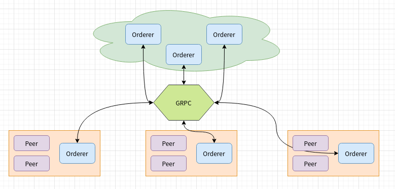

# Raft

## 配置

### 配置文件

```yaml
Cluster:
        ReplicationMaxRetries: 12 # 副本失败重试次数，默认12.
        ReplicationRetryTimeout: 5e6 #副本重试间隔时间, 默认5s，单位纳秒
        SendBufferSize: 10
        ClientCertificate:
        ClientPrivateKey:
        ListenPort:
        ListenAddress:
        ServerCertificate:
        ServerPrivateKey:
        RootCAs:
        - ""
        
```

### 创世块

```yaml
Organizations:

    # SampleOrg defines an MSP using the sampleconfig. It should never be used
    # in production but may be used as a template for other definitions.
    - &SampleOrg
        # OrdererEndpoints is a list of all orderers this org runs which clients
        # and peers may to connect to to push transactions and receive blocks respectively.
        OrdererEndpoints:
            - "127.0.0.1:7050"
            
#### orderer type configuration
SampleDevModeEtcdRaft:
        <<: *ChannelDefaults
        Orderer:
            <<: *OrdererDefaults
            OrdererType: etcdraft
            Organizations:
                - <<: *SampleOrg
#### etcd raft configuration   
Orderer: &OrdererDefaults
    # Addresses used to be the list of orderer addresses that clients and peers
    # could connect to.  However, this does not allow clients to associate orderer
    # addresses and orderer organizations which can be useful for things such
    # as TLS validation.  The preferred way to specify orderer addresses is now
    # to include the OrdererEndpoints item in your org definition
    Addresses:
        # - 127.0.0.1:7050
    # Orderer Type: The orderer implementation to start.
    # Available types are "solo", "kafka" and "etcdraft".
    OrdererType: etcdraft        
    EtcdRaft:
        # The set of Raft replicas for this network. For the etcd/raft-based
        # implementation, we expect every replica to also be an OSN. Therefore,
        # a subset of the host:port items enumerated in this list should be
        # replicated under the Orderer.Addresses key above.
        Consenters:
            - Host: raft0.example.com
              Port: 7050
              ClientTLSCert: path/to/ClientTLSCert0
              ServerTLSCert: path/to/ServerTLSCert0
            - Host: raft1.example.com
              Port: 7050
              ClientTLSCert: path/to/ClientTLSCert1
              ServerTLSCert: path/to/ServerTLSCert1
            - Host: raft2.example.com
              Port: 7050
              ClientTLSCert: path/to/ClientTLSCert2
              ServerTLSCert: path/to/ServerTLSCert2

        # Options to be specified for all the etcd/raft nodes. The values here
        # are the defaults for all new channels and can be modified on a
        # per-channel basis via configuration updates.
        Options:
            # TickInterval is the time interval between two Node.Tick invocations.
            TickInterval: 500ms

            # ElectionTick is the number of Node.Tick invocations that must pass
            # between elections. That is, if a follower does not receive any
            # message from the leader of current term before ElectionTick has
            # elapsed, it will become candidate and start an election.
            # ElectionTick must be greater than HeartbeatTick.
            ElectionTick: 10

            # HeartbeatTick is the number of Node.Tick invocations that must
            # pass between heartbeats. That is, a leader sends heartbeat
            # messages to maintain its leadership every HeartbeatTick ticks.
            HeartbeatTick: 1

            # MaxInflightBlocks limits the max number of in-flight append messages
            # during optimistic replication phase.
            MaxInflightBlocks: 5

            # SnapshotIntervalSize defines number of bytes per which a snapshot is taken
            SnapshotIntervalSize: 20 MB
```

## 网络架构



### 协议

#### 块拉取

```text
message SeekInfo {
   // If BLOCK_UNTIL_READY is specified, the reply will block until the requested blocks are available,
   // if FAIL_IF_NOT_READY is specified, the reply will return an error indicating that the block is not
   // found.  To request that all blocks be returned indefinitely as they are created, behavior should be
   // set to BLOCK_UNTIL_READY and the stop should be set to specified with a number of MAX_UINT64
    enum SeekBehavior {
        BLOCK_UNTIL_READY = 0;
        FAIL_IF_NOT_READY = 1;
    }

    // SeekErrorTolerance indicates to the server how block provider errors should be tolerated.  By default,
    // if the deliver service detects a problem in the underlying block source (typically, in the orderer,
    // a consenter error), it will begin to reject deliver requests.  This is to prevent a client from waiting
    // for blocks from an orderer which is stuck in an errored state.  This is almost always the desired behavior
    // and clients should stick with the default STRICT checking behavior.  However, in some scenarios, particularly
    // when attempting to recover from a crash or other corruption, it's desirable to force an orderer to respond
    // with blocks on a best effort basis, even if the backing consensus implementation is in an errored state.
    // In this case, set the SeekErrorResponse to BEST_EFFORT to ignore the consenter errors.
    enum SeekErrorResponse {
        STRICT = 0;
        BEST_EFFORT = 1;
    }
    SeekPosition start = 1;               // The position to start the deliver from
    SeekPosition stop = 2;                // The position to stop the deliver
    SeekBehavior behavior = 3;            // The behavior when a missing block is encountered
    SeekErrorResponse error_response = 4; // How to respond to errors reported to the deliver service
}
```

