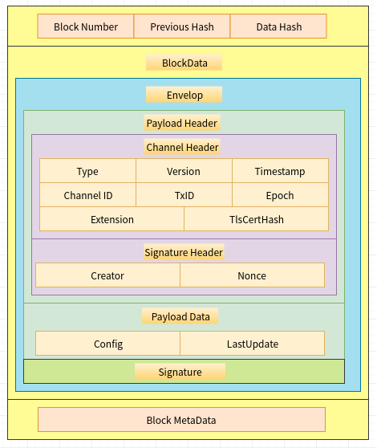

# 创世块

## 结构



## 区块头

* 创世区块的块号为0, 前向引用哈希为nil
* Data Hash为BlockData部分的哈希值

## 交易

创世区块只包含一个交易, 数据类型是: `Envelop`

### 交易头

* 交易的ChannelHeader初始化代码:



```go
//创建创世区块ChannelHeader
//msgVersion: 0, channelId: 系统通道ID， epoch: 0
payloadChannelHeader := utils.MakeChannelHeader(cb.HeaderType_CONFIG, msgVersion, channelID, epoch)
```



```go
func MakeChannelHeader(headerType cb.HeaderType, version int32, chainID string, epoch uint64) *cb.ChannelHeader {
    return &cb.ChannelHeader{
        Type:    int32(headerType),
        Version: version,
        Timestamp: &timestamp.Timestamp{
            Seconds: time.Now().Unix(),
            Nanos:   0,
        },
        ChannelId: chainID,
        Epoch:     epoch,
    }
}
```



### 交易数据

交易数据`Payload.Data`的数据类型是`ConfigEnvelop`

```go
type ConfigEnvelope struct {
    Config               *Config   `protobuf:"bytes,1,opt,name=config,proto3" json:"config,omitempty"`
    LastUpdate           *Envelope `protobuf:"bytes,2,opt,name=last_update,json=lastUpdate,proto3" json:"last_update,omitempty"`
    XXX_NoUnkeyedLiteral struct{}  `json:"-"`
    XXX_unrecognized     []byte    `json:"-"`
    XXX_sizecache        int32     `json:"-"`
}
type Config struct {
    Sequence             uint64       `protobuf:"varint,1,opt,name=sequence,proto3" json:"sequence,omitempty"`
    ChannelGroup         *ConfigGroup `protobuf:"bytes,2,opt,name=channel_group,json=channelGroup,proto3" json:"channel_group,omitempty"`
    XXX_NoUnkeyedLiteral struct{}     `json:"-"`
    XXX_unrecognized     []byte       `json:"-"`
    XXX_sizecache        int32        `json:"-"`
}
```

`ConfigEnvelop.Config`包含了区块链网络、成员、策略、兼容性等定义。

## 网络定义

### 配置文件

创世块通过`ConfigGroup`树形结构定义网络及相关参数

```go
type ConfigGroup struct {
    Version              uint64
    Groups               map[string]*ConfigGroup //该Group包含的子Group
    Values               map[string]*ConfigValue //该Group中包含的值
    Policies             map[string]*ConfigPolicy //该Group中定义的所有策略
    ModPolicy            string  //修改当前Group需要符合的Policy，Policy在当前Group的Policies被定义
}
type ConfigValue struct {
    Version              uint64
    Value                []byte //配置值
    ModPolicy            string   //修改该值需要符合的Policy, Policy已经定义在所属Group的Policies中
}
type ConfigPolicy struct {
    Version              uint64
    Policy               *Policy  //策略值
    ModPolicy            string  //修改该策略需要符合的Policy, Policy已经定义在所属Group的Policies中
}
```

区块链网络的配置数据通过`Profile`结构进行传递

```go
type Profile struct {
    //联盟名字
    Consortium   string                 `yaml:"Consortium"`
    //应用定义
    Application  *Application           `yaml:"Application"`
    //Orderer定义
    Orderer      *Orderer               `yaml:"Orderer"`
    //预定义联盟集合
    Consortiums  map[string]*Consortium `yaml:"Consortiums"`
    //兼容性定义
    Capabilities map[string]bool        `yaml:"Capabilities"`
    //预定义Policy集合
    Policies     map[string]*Policy     `yaml:"Policies"`
}

type Application struct {
    //该应用的组织集合
    Organizations []*Organization    `yaml:"Organizations"`
    //该应用的兼容性
    Capabilities  map[string]bool    `yaml:"Capabilities"`
    Resources     *Resources         `yaml:"Resources"`
    //该应用下定义的策略
    Policies      map[string]*Policy `yaml:"Policies"`
    //该应用的访问控制定义
    ACLs          map[string]string  `yaml:"ACLs"`
}

type Orderer struct {
    //共识类型
    OrdererType   string                   `yaml:"OrdererType"`
    //共识结点地址
    Addresses     []string                 `yaml:"Addresses"`
    //打包超时时间
    BatchTimeout  time.Duration            `yaml:"BatchTimeout"`
    //一个块中的交易数
    BatchSize     BatchSize                `yaml:"BatchSize"`
    //kafka配置
    Kafka         Kafka                    `yaml:"Kafka"`
    //raft配置
    EtcdRaft      *etcdraft.ConfigMetadata `yaml:"EtcdRaft"`
    //参与共识的组织列表
    Organizations []*Organization          `yaml:"Organizations"`
    //最大通道数
    MaxChannels   uint64                   `yaml:"MaxChannels"`
    //兼容性
    Capabilities  map[string]bool          `yaml:"Capabilities"`
    //预定义策略
    Policies      map[string]*Policy       `yaml:"Policies"`
}

type Consortium struct {
    //联盟的组织列表
    Organizations []*Organization `yaml:"Organizations"`
}
```

### 生成网络定义

```go
func NewChannelGroup(conf *genesisconfig.Profile) (*cb.ConfigGroup, error) {
    channelGroup := cb.NewConfigGroup()
    //从配置文件中导入根Policy定义
    if len(conf.Policies) == 0 {
        logger.Warningf("Default policy emission is deprecated, please include policy specifications for the channel group in configtx.yaml")
        addImplicitMetaPolicyDefaults(channelGroup)  //如果未定义，则使用默认策略
    } else {
        if err := addPolicies(channelGroup, conf.Policies, channelconfig.AdminsPolicyKey); err != nil {
            return nil, errors.Wrapf(err, "error adding policies to channel group")
        }
    }

    //定义网络中的Hash算法
    addValue(channelGroup, channelconfig.HashingAlgorithmValue(), channelconfig.AdminsPolicyKey)
    //定义hash参数???
    addValue(channelGroup, channelconfig.BlockDataHashingStructureValue(), channelconfig.AdminsPolicyKey)
    //添加orderer集群地址
    if conf.Orderer != nil && len(conf.Orderer.Addresses) > 0 {
        addValue(channelGroup, channelconfig.OrdererAddressesValue(conf.Orderer.Addresses), ordererAdminsPolicyName)
    }
    //添加通道属于的联盟名字, 创世块不需要
    if conf.Consortium != "" {
        addValue(channelGroup, channelconfig.ConsortiumValue(conf.Consortium), channelconfig.AdminsPolicyKey)
    }
    //添加网络的Capabilities
    if len(conf.Capabilities) > 0 {
        addValue(channelGroup, channelconfig.CapabilitiesValue(conf.Capabilities), channelconfig.AdminsPolicyKey)
    }

    var err error
    //添加Orderer定义
    if conf.Orderer != nil {
        channelGroup.Groups[channelconfig.OrdererGroupKey], err = NewOrdererGroup(conf.Orderer)
        if err != nil {
            return nil, errors.Wrap(err, "could not create orderer group")
        }
    }
    //添加应用定义
    if conf.Application != nil {
        channelGroup.Groups[channelconfig.ApplicationGroupKey], err = NewApplicationGroup(conf.Application)
        if err != nil {
            return nil, errors.Wrap(err, "could not create application group")
        }
    }

    //添加联盟定义
    if conf.Consortiums != nil {
        channelGroup.Groups[channelconfig.ConsortiumsGroupKey], err = NewConsortiumsGroup(conf.Consortiums)
        if err != nil {
            return nil, errors.Wrap(err, "could not create consortiums group")
        }
    }

    channelGroup.ModPolicy = channelconfig.AdminsPolicyKey
    return channelGroup, nil
}
```

