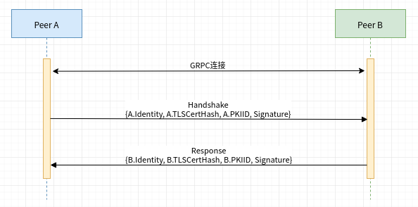

# 通信层

## 服务定义

通信层提供一个GRPC服务，定义如下:


```go
// GossipServer is the server API for Gossip service.
type GossipServer interface {
	// GossipStream is the gRPC stream used for sending and receiving messages
	GossipStream(Gossip_GossipStreamServer) error
	// Ping is used to probe a remote peer's aliveness
	Ping(context.Context, *Empty) (*Empty, error)
}
```


同时通信层提供一个抽象接口方便上层应用使用

```go
type Comm interface {
	GetPKIid() common.PKIidType  //返回当前节点的PKIID
	Send(msg *proto.SignedGossipMessage, peers ...*RemotePeer) //向其它节点发送消息
	//向其它节点发送消息并等待ack
	SendWithAck(msg *proto.SignedGossipMessage, timeout time.Duration, minAck int, peers ...*RemotePeer) AggregatedSendResult
	//探活远端节点
	Probe(peer *RemotePeer) error
	//发起握手
	Handshake(peer *RemotePeer) (api.PeerIdentityType, error)
	//注册订阅感兴趣的消息
	Accept(common.MessageAcceptor) <-chan proto.ReceivedMessage
	//监听已经断开的连接
	PresumedDead() <-chan common.PKIidType
	//关闭到指定远端的连接
	CloseConn(peer *RemotePeer)
	//关闭通信层
	Stop()
}
```

## 服务实现

`comm.commImpl`是通信层服务的实现


```go
type commImpl struct {
	sa             api.SecurityAdvisor
	tlsCerts       *common.TLSCertificates
	pubSub         *util.PubSub
	peerIdentity   api.PeerIdentityType
	idMapper       identity.Mapper
	logger         util.Logger
	opts           []grpc.DialOption
	secureDialOpts func() []grpc.DialOption
	connStore      *connectionStore
	PKIID          []byte
	deadEndpoints  chan common.PKIidType  //包含所有已经断连的节点，默认缓冲大小为100
	msgPublisher   *ChannelDeMultiplexer   //消息广播分发器
	lock           *sync.Mutex
	exitChan       chan struct{}
	stopWG         sync.WaitGroup
	subscriptions  []chan proto.ReceivedMessage  //消息订阅列表
	stopping       int32
	metrics        *metrics.CommMetrics
	dialTimeout    time.Duration
	connTimeout    time.Duration
	recvBuffSize   int
	sendBuffSize   int
}
```


### `GossipStream`方法


```go
func (c *commImpl) GossipStream(stream proto.Gossip_GossipStreamServer) error {
	if c.isStopping() {
		return fmt.Errorf("Shutting down")
	}
	//第一次连接，需要进行认证
	connInfo, err := c.authenticateRemotePeer(stream, false)
	if err != nil {
		c.logger.Errorf("Authentication failed: %v", err)
		return err
	}
	c.logger.Debug("Servicing", extractRemoteAddress(stream))

	conn := c.connStore.onConnected(stream, connInfo, c.metrics)

	h := func(m *proto.SignedGossipMessage) {
		c.msgPublisher.DeMultiplex(&ReceivedMessageImpl{
			conn:                conn,
			lock:                conn,
			SignedGossipMessage: m,
			connInfo:            connInfo,
		})
	}
	conn.handler = interceptAcks(h, connInfo.ID, c.pubSub)
	defer func() {
		c.logger.Debug("Client", extractRemoteAddress(stream), " disconnected")
		c.connStore.closeByPKIid(connInfo.ID)
		conn.close()
	}()
	return conn.serviceConnection()
}
```


### `Ping`方法


```go
func (c *commImpl) Ping(context.Context, *proto.Empty) (*proto.Empty, error) {
	return &proto.Empty{}, nil
}
```


### 其它方法

```go
func (c *commImpl) SetDialOpts(opts ...grpc.DialOption)
//向远端节点发送消息
func (c *commImpl) Send(msg *proto.SignedGossipMessage, peers ...*RemotePeer)
//向远端节点发送消息，并等待ACK
func (c *commImpl) SendWithAck(msg *proto.SignedGossipMessage, timeout time.Duration, minAck int, peers ...*RemotePeer) AggregatedSendResult
//向远端节点发送一个Ping包探活
func (c *commImpl) Probe(remotePeer *RemotePeer) error
//与远端节点启动握手流程
func (c *commImpl) Handshake(remotePeer *RemotePeer) (api.PeerIdentityType, error)
//向通信层注册接收感兴趣的消息
func (c *commImpl) Accept(acceptor common.MessageAcceptor) <-chan proto.ReceivedMessage
//返回包含所有断连节点的通道
func (c *commImpl) PresumedDead() <-chan common.PKIidType
func (c *commImpl) CloseConn(peer *RemotePeer)
func (c *commImpl) Stop() 
func (c *commImpl) GetPKIid() common.PKIidType
```

## 连接握手

Fabric网络中的节点间可以建立点对点连接，在建立连接前需要完成一次节点身份认证。



握手时一个节点与另外一个节点建立GRPC连接，在双方交换身份信息前，发起方会通过Ping命令检测对方是否在线。


```go
func (c *commImpl) Handshake(remotePeer *RemotePeer) (api.PeerIdentityType, error) {
	var dialOpts []grpc.DialOption
	dialOpts = append(dialOpts, c.secureDialOpts()...)
	dialOpts = append(dialOpts, grpc.WithBlock())
	dialOpts = append(dialOpts, c.opts...)
	ctx := context.Background()
	ctx, cancel := context.WithTimeout(ctx, c.dialTimeout)
	defer cancel()
	cc, err := grpc.DialContext(ctx, remotePeer.Endpoint, dialOpts...)
	if err != nil {
		return nil, err
	}
	defer cc.Close()

    //建立GRPC连接
	cl := proto.NewGossipClient(cc)
	ctx, cancel = context.WithTimeout(context.Background(), DefConnTimeout)
	defer cancel()
	//探测节点是否存活
	if _, err = cl.Ping(ctx, &proto.Empty{}); err != nil {
		return nil, err
	}
	ctx, cancel = context.WithTimeout(context.Background(), handshakeTimeout)
	defer cancel()
	//发起连接建立请求
	stream, err := cl.GossipStream(ctx)
	if err != nil {
		return nil, err
	}
	//节点之间交换身份信息，并认证
	connInfo, err := c.authenticateRemotePeer(stream, true)
	if err != nil {
		c.logger.Warningf("Authentication failed: %v", err)
		return nil, err
	}
	if len(remotePeer.PKIID) > 0 && !bytes.Equal(connInfo.ID, remotePeer.PKIID) {
		return nil, fmt.Errorf("PKI-ID of remote peer doesn't match expected PKI-ID")
	}
	return connInfo.Identity, nil
}
```


在确认对方在线后，双方互相发送一个[连接建立消息](https://app.gitbook.com/@me020523/s/fabric/~/drafts/-LqoydU-0k79xp9FJWFw/primary/wang-luo-ceng/gossip-xie-yi#lian-jie-jian-li-xiao-xi)，消息中包含身份信息，在收到对方的身份信息后，节点会对身份信息进行检验。


```go
func (c *commImpl) authenticateRemotePeer(stream stream, initiator bool) (*proto.ConnectionInfo, error) {
	ctx := stream.Context()
	remoteAddress := extractRemoteAddress(stream)  //获取对方IP地址
	remoteCertHash := extractCertificateHashFromContext(ctx) //获取对方Tls证书的sha256 hash值
	var err error
	var cMsg *proto.SignedGossipMessage
	useTLS := c.tlsCerts != nil
	var selfCertHash []byte
	if useTLS {
		certReference := c.tlsCerts.TLSServerCert
		if initiator {
			certReference = c.tlsCerts.TLSClientCert
		}
		//计算自己的tls证书sha265 hash值
		selfCertHash = certHashFromRawCert(certReference.Load().(*tls.Certificate).Certificate[0])
	}
	signer := func(msg []byte) ([]byte, error) {
		return c.idMapper.Sign(msg)
	}
	// TLS enabled but not detected on other side
	if useTLS && len(remoteCertHash) == 0 {
		return nil, fmt.Errorf("No TLS certificate")
	}
	//创建连接建立消息
	cMsg, err = c.createConnectionMsg(c.PKIID, selfCertHash, c.peerIdentity, signer)
	if err != nil {
		return nil, err
	}
	stream.Send(cMsg.Envelope) //将消息发送给对方
	m, err := readWithTimeout(stream, c.connTimeout, remoteAddress) //获取对方的连接建立消息
	if err != nil {
		return nil, err
	}
	receivedMsg := m.GetConn()
	if receivedMsg == nil {
		return nil, fmt.Errorf("Wrong type")
	}
	//对方的PKIID必须不为空
	if receivedMsg.PkiId == nil {
		c.logger.Warningf("%s didn't send a pkiID", remoteAddress)
		return nil, fmt.Errorf("No PKI-ID")
	}
	err = c.idMapper.Put(receivedMsg.PkiId, receivedMsg.Identity)
	if err != nil {
		return nil, err
	}

	connInfo := &proto.ConnectionInfo{
		ID:       receivedMsg.PkiId,
		Identity: receivedMsg.Identity,
		Endpoint: remoteAddress,
		Auth: &proto.AuthInfo{
			Signature:  m.Signature,
			SignedData: m.Payload,
		},
	}
	if useTLS {
	    //保证对方的发送TLS证书与建立TLS连接使用的证书一致
		if !bytes.Equal(remoteCertHash, receivedMsg.TlsCertHash) {
			return nil, errors.Errorf("Expected %v in remote hash of TLS cert, but got %v", remoteCertHash, receivedMsg.TlsCertHash)
		}
	}
	// 确保发送消息来源没有被中间人拦截
	verifier := func(peerIdentity []byte, signature, message []byte) error {
		pkiID := c.idMapper.GetPKIidOfCert(api.PeerIdentityType(peerIdentity))
		return c.idMapper.Verify(pkiID, signature, message)
	}
	err = m.Verify(receivedMsg.Identity, verifier)
	if err != nil {
		return nil, err
	}
	return connInfo, nil
}
```


节点身份验证通过后，双方握手成功。连接握手的目的是为了对远端节点的身份进行确认。

## 身份管理

### PKIID

Fabric网络中的每一个节点都有一个唯一标识: _**PKIID**_.


```go
func (s *MSPMessageCryptoService) GetPKIidOfCert(peerIdentity api.PeerIdentityType) common.PKIidType {
	// Validate arguments
	if len(peerIdentity) == 0 {
		mcsLogger.Error("Invalid Peer Identity. It must be different from nil.")
		return nil
	}
	sid, err := s.deserializer.Deserialize(peerIdentity)
	if err != nil {
		return nil
	}
	// concatenate msp-id and idbytes
	// idbytes is the low-level representation of an identity.
	// it is supposed to be already in its minimal representation

	mspIdRaw := []byte(sid.Mspid)
	raw := append(mspIdRaw, sid.IdBytes...)

	// Hash
	digest, err := factory.GetDefault().Hash(raw, &bccsp.SHA256Opts{})
	if err != nil {
		return nil
	}
	return digest
}
```


PKIID是节点身份和节点MSP ID的sha256 hash值。

### 身份存储

两个节点握手成功后，节点会将对方PKIID和对方身份存放在`identity.Mapper`中，方便后续使用。`identity.Mapper`是一个接口，定义如下:


```go
type Mapper interface {
	Put(pkiID common.PKIidType, identity api.PeerIdentityType) error
	Get(pkiID common.PKIidType) (api.PeerIdentityType, error)
	Sign(msg []byte) ([]byte, error)
	Verify(vkID, signature, message []byte) error
	GetPKIidOfCert(api.PeerIdentityType) common.PKIidType
	SuspectPeers(isSuspected api.PeerSuspector)
	IdentityInfo() api.PeerIdentitySet
	Stop()
}
```


该接口存在一个唯一实现`identity.identityMapperImpl`


```go
type identityMapperImpl struct {
	onPurge    purgeTrigger
	mcs        api.MessageCryptoService
	sa         api.SecurityAdvisor
	pkiID2Cert map[string]*storedIdentity  //节点PKIID与节点身份映射
	sync.RWMutex
	stopChan chan struct{}
	sync.Once
	selfPKIID string
}
//节点身份存储结构
type storedIdentity struct {
	pkiID           common.PKIidType
	lastAccessTime  int64
	peerIdentity    api.PeerIdentityType
	orgId           api.OrgIdentityType  //节点所在的组织
	expirationTimer *time.Timer  //身份过期计时器
}
```


### 身份清理

`identity.identityMapperImpl`提供了一些机制用于清理无用或过期的身份信息。

新建`identity.identityMapperImpl`实例时，peer节点会启动一个goroutine定期清理身份


```go
func NewIdentityMapper(mcs api.MessageCryptoService, selfIdentity api.PeerIdentityType, onPurge purgeTrigger, sa api.SecurityAdvisor) Mapper {
	//....
	go idMapper.periodicalPurgeUnusedIdentities()
	//....
}

func (is *identityMapperImpl) periodicalPurgeUnusedIdentities() {
	//超过usageTh时间没有使用用的身份会被清理，默认是一个小时
	usageTh := GetIdentityUsageThreshold()
	for {
		select {
		case <-is.stopChan:
			return
		case <-time.After(usageTh / 10):
			is.SuspectPeers(func(_ api.PeerIdentityType) bool {
				return false
			})
		}
	}
}
```


清理身份的goroutine会定期按规则选择出待清理的身份:

```go
func (is *identityMapperImpl) SuspectPeers(isSuspected api.PeerSuspector) {
	for _, identity := range is.validateIdentities(isSuspected) {
		identity.cancelExpirationTimer()
		is.delete(identity.pkiID, identity.peerIdentity)
	}
}
func (is *identityMapperImpl) validateIdentities(isSuspected api.PeerSuspector) []*storedIdentity {
	now := time.Now()
	usageTh := GetIdentityUsageThreshold()
	is.RLock()
	defer is.RUnlock()
	var revokedIdentities []*storedIdentity
	for pkiID, storedIdentity := range is.pkiID2Cert {
		//最近一段时间没有访问过的身份
		if pkiID != is.selfPKIID && storedIdentity.fetchLastAccessTime().Add(usageTh).Before(now) {
			revokedIdentities = append(revokedIdentities, storedIdentity)
			continue
		}
		//满足一定规则的身份
		if !isSuspected(storedIdentity.peerIdentity) {
			continue
		}
		//校验不通过的身份
		if err := is.mcs.ValidateIdentity(storedIdentity.fetchIdentity()); err != nil {
			revokedIdentities = append(revokedIdentities, storedIdentity)
		}
	}
	return revokedIdentities
}
```

节点身份也会过期，所以在添加节点身份时，会自动注册一个定时器，当节点身份过期时自己删除已经过期的身份

```go
func (is *identityMapperImpl) Put(pkiID common.PKIidType, identity api.PeerIdentityType) error {
    //省略一些代码
	var expirationTimer *time.Timer
	if !expirationDate.IsZero() {
		if time.Now().After(expirationDate) {
			return errors.New("identity expired")
		}
		//注册过期自动删除计时器
		timeToLive := expirationDate.Add(time.Millisecond).Sub(time.Now())
		expirationTimer = time.AfterFunc(timeToLive, func() {
			is.delete(pkiID, identity)
		})
	}
	is.pkiID2Cert[string(id)] = newStoredIdentity(pkiID, identity, expirationTimer, is.sa.OrgByPeerIdentity(identity))
	return nil
}
```

`identity.identityMapperImpl`也可以通过调用`SuspectPeers`方法手动清理身份

## 连接管理

### `comm.connectionStore`

结构体`comm.connectionStore`管理节点双方建立的连接


```go
type ConnConfig struct {
	RecvBuffSize int  //接收缓冲区大小，默认值为20，配置文件peer.gossip.recvBuffSize值
	SendBuffSize int //发送缓冲区大小，默认值为20，配置文件peer.gossip.sendBuffSize值
}
type connectionStore struct {
	config           ConnConfig
	logger           util.Logger            // logger
	isClosing        bool                   // whether this connection store is shutting down
	connFactory      connFactory            // creates a connection to remote peer
	sync.RWMutex                            // synchronize access to shared variables
	pki2Conn         map[string]*connection // mapping between pkiID to connections
	destinationLocks map[string]*sync.Mutex //mapping between pkiIDs and locks,
	// used to prevent concurrent connection establishment to the same remote endpoint
}
//获取到指定节点的连接，如果不存在，则创建一个新的连接
func (cs *connectionStore) getConnection(peer *RemotePeer) (*connection, error)
//返回维护的连接数
func (cs *connectionStore) connNum() int
//关闭与指定节点的连接
func (cs *connectionStore) closeConn(peer *RemotePeer)
func (cs *connectionStore) closeByPKIid(pkiID common.PKIidType)
//关闭该connection store
func (cs *connectionStore) shutdown()
//连接建立回调，并注册新连接
func (cs *connectionStore) onConnected(serverStream proto.Gossip_GossipStreamServer,
	connInfo *proto.ConnectionInfo, metrics *metrics.CommMetrics) *connection
func (cs *connectionStore) registerConn(connInfo *proto.ConnectionInfo,
	serverStream proto.Gossip_GossipStreamServer, metrics *metrics.CommMetrics) *connection
```


当节点间握手通过后，会通过`connectionStore.onConnected`通知`connectionStore`建立双方的连接

```go
func (c *commImpl) GossipStream(stream proto.Gossip_GossipStreamServer) error {
	//忽略一些代码...
	conn := c.connStore.onConnected(stream, connInfo, c.metrics)
	//忽略一些代码...
}
```

### `comm.connection`

`comm.connection`代表节点之间的一个连接


```go
type connection struct {
	recvBuffSize int  //接收缓冲区大小
	metrics      *metrics.CommMetrics 
	cancel       context.CancelFunc
	info         *proto.ConnectionInfo
	outBuff      chan *msgSending  //发送缓冲区
	logger       util.Logger                     // logger
	pkiID        common.PKIidType                // 远端节点PKIID
	handler      handler                         // function to invoke upon a message reception
	conn         *grpc.ClientConn                // gRPC connection to remote endpoint
	cl           proto.GossipClient              // gRPC stub of remote endpoint
	clientStream proto.Gossip_GossipStreamClient // client-side stream to remote endpoint
	serverStream proto.Gossip_GossipStreamServer // server-side stream to remote endpoint
	stopFlag     int32                           //连接关闭标志
	stopChan     chan struct{}         // 通知连接处理goroutine该连接已经关闭
	sync.RWMutex                                 // synchronizes access to shared variables
}
//关闭连接
func (conn *connection) close()
//连接是否关闭
func (conn *connection) toDie() bool
//排空积压的缓冲区数据
func (conn *connection) drainOutputBuffer()
//启动消息处理
func (conn *connection) serviceConnection() error
//向对方发送消息
func (conn *connection) send(msg *proto.SignedGossipMessage, onErr func(error), shouldBlock blockingBehavior)
//读取对方的消息
func (conn *connection) readFromStream(errChan chan error, quit chan struct{}, msgChan chan *proto.SignedGossipMessage)
//获取连接的stream
func (conn *connection) getStream() stream
```


### 发送与接收消息

通过调用`send`方法可以将消息发送给远端节点，该方法先将要发送的消息先提交到发送缓冲区。

```go
func (conn *connection) send(msg *proto.SignedGossipMessage, onErr func(error), shouldBlock blockingBehavior) {
	if conn.toDie() {
		return
	}
	//发送消息结构
	m := &msgSending{
		envelope: msg.Envelope,
		onErr:    onErr,
	}
	select {
	case conn.outBuff <- m:  //将消息放入缓冲区
	default: 
		if shouldBlock {
			//等待缓空区可写
			conn.outBuff <- m // 将消息放入缓冲区
		} else {
			conn.metrics.BufferOverflow.Add(1) //缓冲区满计数
		}
	}
}
```

缓冲区内的数据被后台goroutine处理并通过GRPC连接发送给对端。后台goroutine是在连接建立时启动的

```go
func (c *commImpl) GossipStream(stream proto.Gossip_GossipStreamServer) error {
	//忽略一些代码
	return conn.serviceConnection()
}
//启动消息处理
func (conn *connection) serviceConnection() error {
	errChan := make(chan error, 1)
	msgChan := make(chan *proto.SignedGossipMessage, conn.recvBuffSize)
	quit := make(chan struct{})
	
	go conn.readFromStream(errChan, quit, msgChan)
	go conn.writeToStream()
	//忽略一些代码
	return nil
}
```

`connection.writeToStream`将发送缓冲区内的消息依次发送

```go
func (conn *connection) writeToStream() {
	for !conn.toDie() {
		stream := conn.getStream()
		if stream == nil {
			return
		}
		select {
		case m := <-conn.outBuff:
			err := stream.Send(m.envelope)  //将消息发送给对端
			if err != nil {
				go m.onErr(err)  //处理消息发送失败的回调函数
				return
			}
		case stop := <-conn.stopChan:
			conn.stopChan <- stop  //向其它goroutine传递关闭事件
			return
		}
	}
}
```

`connection.readFromStream`从GRPC连接中读取远端发送的消息，并写入一个接收缓冲区

```go
func (conn *connection) readFromStream(errChan chan error, quit chan struct{}, msgChan chan *proto.SignedGossipMessage) {
	for !conn.toDie() {
		stream := conn.getStream()
		if stream == nil {
			errChan <- fmt.Errorf("Stream is nil")
			return
		}
		envelope, err := stream.Recv() //从对端读取消息
		if conn.toDie() {
			return
		}
		if err != nil {
			errChan <- err
			return
		}
		conn.metrics.ReceivedMessages.Add(1)
		msg, err := envelope.ToGossipMessage()
		if err != nil {
			errChan <- err
		}
		select {
		case msgChan <- msg:
		case <-quit:
			return
		}
	}
}
```

### 处理消息

连接建立后会注册消息处理函数

```go
func (c *commImpl) GossipStream(stream proto.Gossip_GossipStreamServer) error {
	//省略一些代码
	conn := c.connStore.onConnected(stream, connInfo, c.metrics)

    //消息处理函数
	h := func(m *proto.SignedGossipMessage) {
	    //对接收到的消息进行广播
		c.msgPublisher.DeMultiplex(&ReceivedMessageImpl{
			conn:                conn,
			lock:                conn,
			SignedGossipMessage: m,
			connInfo:            connInfo,
		})
	}
	//拦截ACK消息
	conn.handler = interceptAcks(h, connInfo.ID, c.pubSub)
	//省略一些代码
	return conn.serviceConnection()
}

func interceptAcks(nextHandler handler, remotePeerID common.PKIidType, pubSub *util.PubSub) func(*proto.SignedGossipMessage) {
	return func(m *proto.SignedGossipMessage) {
		if m.IsAck() {
			topic := topicForAck(m.Nonce, remotePeerID)
			pubSub.Publish(topic, m.GetAck())
			return
		}
		nextHandler(m)
	}
}
```

连接处理启动时会逐个处理接收缓冲区内的消息

```go
func (c *commImpl) GossipStream(stream proto.Gossip_GossipStreamServer) error {
	//忽略一些代码
	return conn.serviceConnection()
}
//启动消息处理
func (conn *connection) serviceConnection() error {
	errChan := make(chan error, 1)
	msgChan := make(chan *proto.SignedGossipMessage, conn.recvBuffSize)
	quit := make(chan struct{})
	
	//省略一些代码
	for !conn.toDie() {
		select {
		case stop := <-conn.stopChan:
			conn.stopChan <- stop  //传递关闭事件给其它goroutine
			return nil
		case err := <-errChan:
			return err
		case msg := <-msgChan:
			conn.handler(msg)   //处理消息
		}
	}
	return nil
}
```

## 消息广播

### `ChannelDeMultiplexer`结构

通信层并不直接处理消息，而是在处理消息时把消息广播给所有感兴趣的订阅者。通信层通过`comm.ChannelDeMultiplexer`结构完成


```go
type MessageAcceptor func(interface{}) bool  //消息过滤器
type channel struct {
	pred common.MessageAcceptor
	ch   chan interface{}
}
type ChannelDeMultiplexer struct {
	channels []*channel
	lock     *sync.RWMutex
	closed   bool
}
//添加一个订阅通道，通道缓冲区默认为10
func (m *ChannelDeMultiplexer) AddChannel(predicate common.MessageAcceptor) chan interface{}
//关闭DeMultiplexer
func (m *ChannelDeMultiplexer) Close()
//广播消息
func (m *ChannelDeMultiplexer) DeMultiplex(msg interface{})
```


### 注册订阅

上层应用可以通过Accept方法向通信层注册订阅感兴趣的消息

```go
func (c *commImpl) Accept(acceptor common.MessageAcceptor) <-chan proto.ReceivedMessage {
	genericChan := c.msgPublisher.AddChannel(acceptor)
	specificChan := make(chan proto.ReceivedMessage, 10)

	if c.isStopping() {
		return specificChan
	}

	c.lock.Lock()
	c.subscriptions = append(c.subscriptions, specificChan)
	c.lock.Unlock()

	c.stopWG.Add(1)
	go func() {
		defer c.stopWG.Done()
		for {
			select {
			case msg := <-genericChan:
				if msg == nil {
					return
				}
				select {
				case specificChan <- msg.(*ReceivedMessageImpl):
				case <-c.exitChan:
					return
				}
			case <-c.exitChan:
				return
			}
		}
	}()
	return specificChan
}
```

Accept方法会启动一个goroutine处理ChannelDeMultiplexer通道里的消息并将消息转换成`ReceivedMessage`结构重新发布。

## 消息发送

通信层提供消息Send方法和SendWithAck方法，方便上层应用不用关心具体的连接进行消息的发送。

### `Send`方法

```go
func (c *commImpl) Send(msg *proto.SignedGossipMessage, peers ...*RemotePeer) {
	if c.isStopping() || len(peers) == 0 {
		return
	}
	for _, peer := range peers {
		//为每个peer启动一个goroutine发送消息
		go func(peer *RemotePeer, msg *proto.SignedGossipMessage) {
			c.sendToEndpoint(peer, msg, nonBlockingSend)
		}(peer, msg)
	}
}

func (c *commImpl) sendToEndpoint(peer *RemotePeer, msg *proto.SignedGossipMessage, shouldBlock blockingBehavior) {
	if c.isStopping() {
		return
	}
	var err error

	conn, err := c.connStore.getConnection(peer)  //获取远端节点的连接
	if err == nil {
		disConnectOnErr := func(err error) {
			//发送失败，断开该连接
			c.disconnect(peer.PKIID)
		}
		conn.send(msg, disConnectOnErr, shouldBlock)  //调用连接发送消息
		return
	}
	c.disconnect(peer.PKIID)  //获取连接失败，断开与该节点的连接
}
```

### `SendWithAck`方法

SendWithAck方法与Send方法的差别在于前者需要等待远端的ACK消息，后者不需要。

```go
func (c *commImpl) SendWithAck(msg *proto.SignedGossipMessage, timeout time.Duration, minAck int, peers ...*RemotePeer) AggregatedSendResult {
	if len(peers) == 0 {
		return nil
	}
	var err error
	msg.Nonce = util.RandomUInt64()  //为这条消息生成一个随机Nonce
	msg, err = msg.NoopSign()
	if c.isStopping() || err != nil {
		if err == nil {
			err = errors.New("comm is stopping")
		}
		results := []SendResult{}
		for _, p := range peers {
			results = append(results, SendResult{
				error:      err,
				RemotePeer: *p,
			})
		}
		return results
	}

	sndFunc := func(peer *RemotePeer, msg *proto.SignedGossipMessage) {
		c.sendToEndpoint(peer, msg, blockingSend)
	}
	subscriptions := make(map[string]func() error)
	for _, p := range peers {
		topic := topicForAck(msg.Nonce, p.PKIID)   //消息ack主题: "{nonce} {pkiid}"
		sub := c.pubSub.Subscribe(topic, timeout) //按主题订阅消息
		subscriptions[string(p.PKIID)] = func() error {
			msg, err := sub.Listen()
			if err != nil {
				return err
			}
			if msg, isAck := msg.(*proto.Acknowledgement); !isAck {
				return fmt.Errorf("Received a message of type %s, expected *proto.Acknowledgement", reflect.TypeOf(msg))
			} else {
				if msg.Error != "" {
					return errors.New(msg.Error)
				}
			}
			return nil
		}
	}
	waitForAck := func(p *RemotePeer) error {
		return subscriptions[string(p.PKIID)]()
	}
	ackOperation := newAckSendOperation(sndFunc, waitForAck)
	return ackOperation.send(msg, minAck, peers...)
}
```

方法将操作委托给结构`comm.ackSendOperation`


```go
type sendFunc func(peer *RemotePeer, msg *proto.SignedGossipMessage)
type waitFunc func(*RemotePeer) error

type ackSendOperation struct {
	snd        sendFunc
	waitForAck waitFunc
}
```


并执行结构实例的send方法

```go
func (aso *ackSendOperation) send(msg *proto.SignedGossipMessage, minAckNum int, peers ...*RemotePeer) []SendResult {
	successAcks := 0
	results := []SendResult{}

	acks := make(chan SendResult, len(peers))
	// Send to all peers the message
	for _, p := range peers {
		//为每个Peer生成一个goroutine处理
		go func(p *RemotePeer) {
			// Send the message to 'p'
			aso.snd(p, msg)  //发送请求
			// Wait for an ack from 'p', or get an error if timed out
			err := aso.waitForAck(p)  //等待响应
			acks <- SendResult{
				RemotePeer: *p,
				error:      err,
			}
		}(p)
	}
	for {
		ack := <-acks
		results = append(results, SendResult{
			error:      ack.error,
			RemotePeer: ack.RemotePeer,
		})
		if ack.error == nil {
			successAcks++
		}
		if successAcks == minAckNum || len(results) == len(peers) {
			break
		}
	}
	return results
}
```

